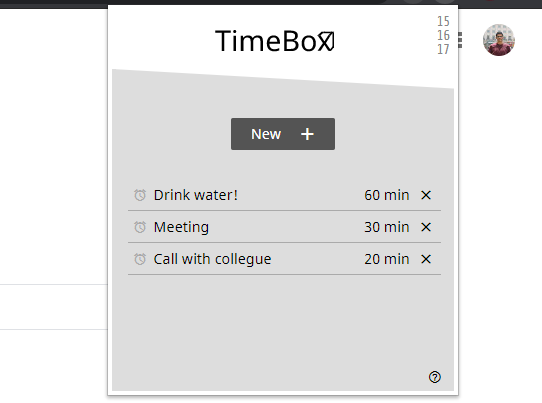

# TimeBox 📦
### Control your time ⏰

## About ❔
TimeBox is a Google Chrome Extention that provides an easy and elegant way of managing your time while woking or studying online. There are no annoying noises or beeps, just simple native notifications and straightforward alert messages.

## Technologies ⌨️
Constructed with plain HTML, CSS and JavaScript.

## Contributions and Goals 🎯
This project is Open Source. You can contribute, send pull requests, and also contact me directly for any issues or bugs (caeudev@gmail.com). Let's make it grow toghether and help others being more productive and time conscious!

Here are some goals that may help with the future development of this work.

- [X] Add and delete TimeBox
- [X] One-time-alert TimeBox
- [X] About Link
- [ ] Show hours and minutes separated in list (e.g. 1h 20m instead of 80min )
- [ ] Repetitive alert TimeBox (e.g. alert each 30min)
- [ ] Personalized icons for each TimeBox
- [ ] Translate to other languages
- [ ] Design improvements
- [ ] Create TimeBox website

🎨 [Figma Layout](https://www.figma.com/file/3XLgVa0tiGCmMNUH86uFEL/TimeBox?node-id=0%3A1)
